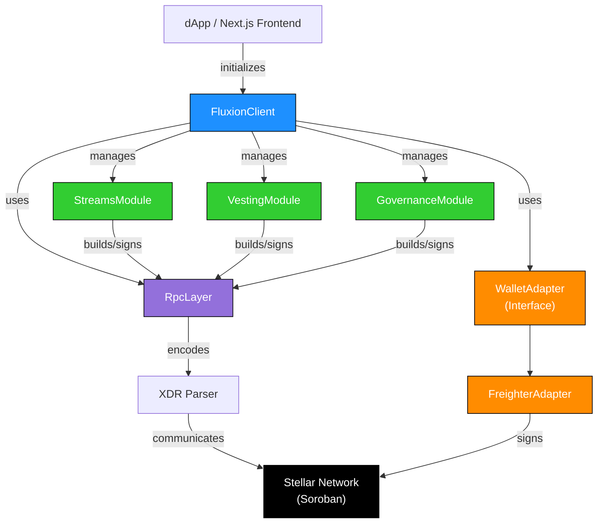

# Fluxion SDK Architecture

## System Design



## Layered Architecture

The SDK is organized in three logical layers:

### 1. Client Layer (`FluxionClient`)

**Responsibility**: Central coordinator and state management

- Manages wallet connection state
- Holds active user address
- Initializes all feature modules
- Provides clean public API

```typescript
export class FluxionClient {
  public readonly config: FluxionConfig;
  public readonly rpc: RpcLayer;
  public readonly walletAdapter: WalletAdapter;
  public activeAddress: string | null;

  public readonly streams: StreamsModule;
  public readonly vesting: VestingModule;
  public readonly governance: GovernanceModule;
}
```

### 2. Feature Modules (`*Module`)

**Responsibility**: Domain-specific business logic

Each module implements high-level operations:

- **StreamsModule**: Continuous token streaming
  - `createStream()` - Initialize new payment stream
  - `withdraw()` - Claim vested tokens
  - `cancelStream()` - Stop active stream
  - `getStream()` - Query stream state

- **VestingModule**: Token vesting schedules
  - `createVesting()` - Create vesting schedule
  - `claimVested()` - Claim vested tokens
  - `getVestingStatus()` - Check schedule status

- **GovernanceModule**: Protocol administration
  - `emergencyPause()` - Emergency stop protocol

Modules follow consistent patterns:
- Accept domain-specific parameters
- Validate wallet connection
- Build and simulate transactions
- Return typed `TransactionResult`

### 3. Infrastructure Layer

#### WalletAdapter Interface

**Pattern**: Abstract interface for wallet providers

```typescript
export interface WalletAdapter {
  connect(): Promise<string>;
  disconnect(): Promise<void>;
  getAddress(): Promise<string | null>;
  signTransaction(txXdr: string, networkPassphrase: string): Promise<string>;
  signAuthEntry(preimageXdr: string): Promise<string>;
}
```

**Implementations**:
- `FreighterAdapter` - Browser extension wallet (default)
- Extensible for WalletConnect, Albedo, etc.

#### RpcLayer

**Responsibility**: Stellar/Soroban RPC communication

- Transaction simulation via `server.simulateTransaction()`
- Transaction submission via `server.sendTransaction()`
- Result polling via `server.pollTransaction()`
- Error transformation to typed exceptions

```typescript
export class RpcLayer {
  async simulate(tx: Transaction): Promise<SimulateTransactionResponse>;
  async submitAndPoll(signedTxXdr: string): Promise<TransactionResult>;
}
```

#### XDR Parser

**Responsibility**: Soroban XDR encoding/decoding

- Type-safe parameter encoding via `nativeToScVal()`
- Response parsing via `scValToNative()`
- Error isolation with `ParsingError`

```typescript
export function encodeParam(value: unknown, type: ScValType): xdr.ScVal;
export function decodeResponse<T>(scVal: xdr.ScVal | string): T;
```

## Data Flow

### Transaction Execution Flow

```
User Action
    ↓
Module Method Called (e.g., createStream)
    ↓
Validate Wallet Connection
    ↓
Encode Parameters to XDR via encodeParam()
    ↓
Build TransactionBuilder with encoded args
    ↓
RpcLayer.simulate(tx)
    ↓
Freighter.signTransaction(assembledTx)
    ↓
RpcLayer.submitAndPoll(signedTxXdr)
    ↓
Parse Response via decodeResponse()
    ↓
Return TransactionResult
```

### Read Query Flow

```
Module Method Called (e.g., getStream)
    ↓
Build Read-Only Transaction
    ↓
RpcLayer.simulate(tx)  [No signing needed]
    ↓
Extract result.retval from simulation
    ↓
Parse via decodeResponse<T>()
    ↓
Return Typed Data (StreamData, VestingSchedule, etc.)
```

## Design Patterns

### 1. Adapter Pattern (Wallet)

```typescript
// Interface defines contract
export interface WalletAdapter { }

// Multiple implementations
export class FreighterAdapter implements WalletAdapter { }
export class WalletConnectAdapter implements WalletAdapter { }

// Client receives adapter at initialization
const client = new FluxionClient(config, customAdapter);
```

**Benefit**: Easy wallet provider switching without code changes

### 2. Module Pattern (Feature Organization)

Each feature is self-contained module:

```typescript
export class StreamsModule {
  private readonly contract: Contract;
  private readonly client: FluxionClient;

  // Internal implementation
  private async buildAndSign() { }

  // Public API
  async createStream() { }
  async withdraw() { }
  async getStream() { }
}
```

**Benefit**: Clear separation of concerns, testable in isolation

### 3. Error Hierarchy (Type Safety)

```typescript
FluxionError (base)
  ├── WalletError
  ├── RpcError
  ├── TransactionError
  ├── ParsingError
  └── ContractError
```

**Benefit**: Caller can catch specific error types

### 4. Type-Safe XDR Encoding

```typescript
// Type parameter ensures compile-time safety
export function encodeParam(value: unknown, type: ScValType): xdr.ScVal

// Caller must specify type
encodeParam(amount, 'i128');    // ✅ Compile-time checked
encodeParam(amount, 'invalid'); // ❌ Compile error
```

**Benefit**: Prevents runtime XDR encoding mismatches

## Module Dependencies

```
┌─────────────────┐
│ FluxionClient   │
└────────┬────────┘
         │
    ┌────┼────┐
    │    │    │
    v    v    v
┌──────────────────────────┐
│ Feature Modules          │
│ Streams / Vesting / Gov  │
└──────────────────────────┘
    │
    ├─→ WalletAdapter
    │   (FreighterAdapter)
    │
    └─→ RpcLayer
        └─→ XDR Parser
```

**Note**: Modules depend on RpcLayer and WalletAdapter; they do NOT depend on each other.

## Scalability Considerations

### 1. Tree-Shaking

Unused modules are automatically removed during bundling:

```typescript
// If app only uses streams, vesting/governance are tree-shaken
import { FluxionClient } from '@fluxion/sdk';

// Users pay for only what they import
import { StreamsModule } from '@fluxion/sdk/streams';
```

### 2. Extensibility Points

- **Wallet Providers**: Implement `WalletAdapter` for new wallets
- **RPC Endpoints**: Swap RPC URL in `NetworkConfig`
- **Error Handling**: Create custom error handlers on error types

### 3. Performance

- **No Runtime Overhead**: All type checking at compile time
- **Lazy Evaluation**: Modules initialized on first use
- **Minimal Dependencies**: Only peer dependencies (Stellar SDK, Freighter)

## Error Handling Strategy

```typescript
// Layer 1: Infrastructure catches errors
try {
  simulation = await rpc.server.simulateTransaction(tx);
} catch (error) {
  throw new RpcError(`Simulation failed: ${error}`);
}

// Layer 2: Caller catches typed errors
try {
  await client.streams.createStream(params);
} catch (error) {
  if (error instanceof WalletError) {
    // Handle wallet issues
  } else if (error instanceof TransactionError) {
    // Handle transaction issues
  }
}
```

## Testing Strategy

- **Unit Tests**: Mock RpcLayer and WalletAdapter
- **Integration Tests**: Testnet deployments with real RPC
- **Property-Based Tests**: Randomized XDR encoding/decoding

Coverage targets:
- Statements: 95%
- Branches: 90%
- Functions: 95%
- Lines: 95%

## Future Enhancements

1. **Batch Transactions**: Execute multiple operations in single TX
2. **Multi-Sig Support**: Authorization handling for multisig contracts
3. **Fee Optimization**: Smart fee estimation and prioritization
4. **Caching Layer**: Cache frequently-read contract state
5. **Event Subscriptions**: WebSocket support for real-time updates

---

For usage examples, see [README.md](../README.md).
For security considerations, see [SECURITY.md](../SECURITY.md).
